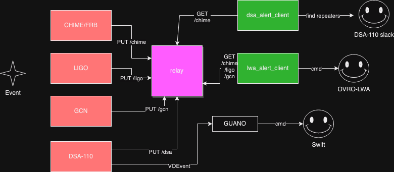

# ovro-alert
Code and services for sending, receiving, and using astronomical alerts at OVRO. Operations instructions are documented in the [wiki](https://github.com/ovrocaltech/ovro-alert/wiki).



## Python versions and deployment

Two environments are intentional:

| Environment | Typical host | Python | Install |
|-------------|--------------|--------|---------|
| **`deployment`** | Observing / calim (`LWAAlertClient`) | 3.6 | Cluster `mnc_python` env; **do not** `pip install -e .` this repo from `pyproject.toml` (requires **≥3.9**) |
| **`fasttransients`** | **lwacalim02** (Slurm pipeline) | 3.9+ | `lwa-fasttransients/scripts/deploy_calim.sh` |

**Observing host (voltage-beam scheduling only):** expose `frb_search_pipeline.slurm_schedule` via `PYTHONPATH`, not a modern editable `ovro-alert` install:

```bash
cd /home/pipeline/proj/ovro-alert
./scripts/deploy_alert_client.sh
```

That activates `deployment`, sources `scripts/alert_client_env.sh` (sets `PYTHONPATH` to `lwa-fasttransients/src`), and runs import smoke tests (including `python3.6` when available).

**Persist env for systemd / long-running clients:**

```bash
conda activate deployment
source /home/pipeline/proj/ovro-alert/scripts/alert_client_env.sh
```

Reference only (do not `conda env create` on production): `environment-alert-client.yml`.

**Relay / FastAPI (major):** use Python **≥3.9** and `pip install -e .` from this repo.

## Requirements
- astropy
- fastapi
- pydantic
- uvicorn
- twisted
- voevent-parse
- slack_sdk
- astropy
- pygcn
- gcn-kafka

## Design and Assumptions

- A central server hosts relay plus one process per alert receiver (e.g., LIGO) -- currently this is on "major"
- Clients at observing resource poll the relay (e.g., OVRO-LWA polls /ligo to see LIGO alerts)
- Observing resource will respond with awareness of telescope state (e.g., OVRO-LWA triggers voltage recording after LIGO event)
- We assume that response is faster than update rate to avoid losing events
- Relay can also just hold info for analysis (e.g., comparing DSA/CHIME FRBs to list of repeaters)

## Applications

Alert scenarios:
- CHIME/FRB to DSA-110 -- Identify co-detections of non-repeating FRBs and alert to new repeating FRBs from CHIME
- CHIME/FRB to OVRO-LWA -- Search for ultra-wide band emission from repeating FRBs from CHIME
- LIGO to OVRO-LWA -- Search for prompt radio counterparts to neutron star mergers
- GCN (Fermi, Swift) to OVRO-LWA -- Search for prompt radio counterparts to short GRBs
- DSA-110 to Swift/GUANO -- Search for prompt high-energy counterparts or afterglows from FRBs (managed by dsa110-event)
- DSA-110 to OVRO-LWA -- Search for ultra-wide band emission from non-repeating FRBs
- Flarescope and OVRO-LWA co-observing -- Automatic OVRO-LWA observing to search for stellar flares
- Optical transients to SPRITE?
- GREX to OVRO-LWA?

### OVRO-LWA

As a low-frequency all-sky monitor, OVRO-LWA is well positioned to respond to fast, dispersed transients. We need a way to poll the relay server and send commands for new OVRO-LWA observations. Two kinds of observation must be supported:
- Trigger voltage buffer dump in response to LIGO NS merger events
- Point a power beam at an FRB detected by CHIME or DSA-110

The OVRO-LWA observing client is in this repo (`ovro_alert/lwa_alert_client.py`).

#### Voltage beam alert → Slurm FRB pipeline

CHIME/CASM/DSA alerts call `submit_voltagebeam`, which queues an ASAP voltage beam SDF and submits `slurm/voltage_beam_pipeline.job` on **lwacalim02**. Processing uses **`lwa-fasttransients`** (`run_pipeline.py` via `lwa-voltage-beam run`), not the legacy `src/pipeline.py` path.

**Deploy (lwacalim02, after `git pull` on pipeline code):**

```bash
conda activate fasttransients
cd /home/pipeline/proj/lwa-fasttransients
./scripts/deploy_calim.sh
```

**Deploy (observing host, `deployment` env):** after `git pull` on both repos:

```bash
cd /home/pipeline/proj/ovro-alert
./scripts/deploy_alert_client.sh
```

Do **not** `pip install -e .` here — `pyproject.toml` requires Python ≥3.9. Scheduling uses `PYTHONPATH=${LWA_FT_ROOT}/src` (see `scripts/alert_client_env.sh`). `ovro_alert.voltage_beam_selection` re-exports `frb_search_pipeline.slurm_schedule`.

**Manual submit / resubmit** (on a host with Slurm + `fasttransients`):

```bash
# Explicit raw file
lwa-voltage-beam submit --file /lustre/ubuntu/beam01/foo.raw --dm 87.3 \
  --duration 300 --ra 83.6 --dec 22.0

# Resubmit from prior job stdout
lwa-voltage-beam resubmit /home/pipeline/slurm/voltage_beam_pipeline-12345.out

# Legacy shims (same commands)
./slurm/submit_voltage_beam_file.sh /lustre/ubuntu/beam01/foo.raw 87.3 300 83.6 22.0
./slurm/resubmit_voltage_beam_from_stdout.sh voltage_beam_pipeline-12345.out
```

**Alert scheduling:** Slurm `--begin` is `now + duration + 600s` (buffer), minimum 300 s lead. Ops override: `OVRO_ALERT_VOLTAGE_PIPELINE_BEGIN_DELAY=now+2hours`.

**Processing duration:** Alert observation length (or DM-derived length) controls the SDF and mtime window only. The pipeline **defaults to all time samples** in the voltage file (`--duration 0`). To cap processing, set `time=N` in manual `sbatch --export` or `lwa-voltage-beam submit --duration N`.

**Useful environment variables:**

| Variable | Where | Purpose |
|----------|-------|---------|
| `OVRO_ALERT_VOLTAGE_BEAM_JOB` | client | Path to `voltage_beam_pipeline.job` |
| `OVRO_ALERT_VOLTAGE_PIPELINE_NODELIST` | client | Slurm nodelist (default `lwacalim02`) |
| `OVRO_ALERT_VOLTAGE_PIPELINE_BEGIN_BUFFER_SEC` | client | Seconds after obs end before job starts (default `600`) |
| `OVRO_ALERT_VOLTAGE_PIPELINE_BEGIN_DELAY` | client | Override dynamic begin (e.g. `now+2hours`) |
| `VOLTAGE_BEAM_SEARCH_DIR` | export | Beam raw directory (default `/lustre/ubuntu/beam01`) |
| `VOLTAGE_BEAM_WINDOW_END_EPOCH` | export | Mtime window end (unix); set by alert client |
| `VOLTAGE_BEAM_LOOKBACK_MIN` | export | Window width in minutes |
| `VOLTAGE_BEAM_RA` / `VOLTAGE_BEAM_DEC` | export | Target position (degrees) |
| `VOLTAGE_BEAM_PRODUCT_ROOT` | Slurm job | Lustre products (default `/lustre/pipeline/teng`) |
| `VOLTAGE_BEAM_START_FROM` | export | Resume `run_pipeline.py` at step `01`–`06` |

Job stdout under `/home/pipeline/slurm/voltage_beam_pipeline-JOBID.out` is parsed for resubmit. Products: `/lustre/pipeline/teng/voltage_beam_JOBID/` (step 05–06 PNGs and CSV).


CHIME/FRB has the highest low-resolution FRB discovery rate. It is a good source of events for OVRO-LWA follow up. We need a way to receive CHIME/FRB events to:
- Identify and send slack notification for CHIME/FRB repeaters
- Identify joint CHIME/DSA events
- Repoint DSA-110 (human in the loop)
- Automatically point beam at OVRO-LWA

The VOEvent receiver uses `twistd` to run the `comet` broker.

### LIGO

LIGO detects NS mergers and provides rough localizations to guide OVRO-LWA search for prompt counterparts. We need a way to receive LIGO events to:
- Notify on slack
- Automatically trigger voltage buffer dump at OVRO-LWA

The LIGO receiver uses `pygcn` to parse the event stream.

### DSA-110

DSA-110 discovers FRBs and provides rapid triggers to Swift/BAT and (optionally) repointing for XRT. Alerts received by GUANO. First implementation done for [realfast](https://github.com/realfastvla/realfast/blob/main/realfast/util.py#L98) and now working at DSA-110

### GCN

Swift, Fermi, and other all-sky, high-energy transient search systems distribute alerts publicly with low latency. Short GRBs are caused by binary NS mergers, which may be detectable as prompt fast radio emission. 
We receive events and filter for short GRBs to:
- Notify on slack
- Automatically trigger beamforming at OVRO-LWA

The GCN receiver uses `pygcn` to parse the event stream.

### Flarescope

We need a way to start a beamformed observation at OVRO-LWA in coincidence with Flarescope:
- Create SDF for a given (RA, Dec, start time, duration). Optionally set name or integration time.
- Ensure beams are calibrated
- Run SDF
